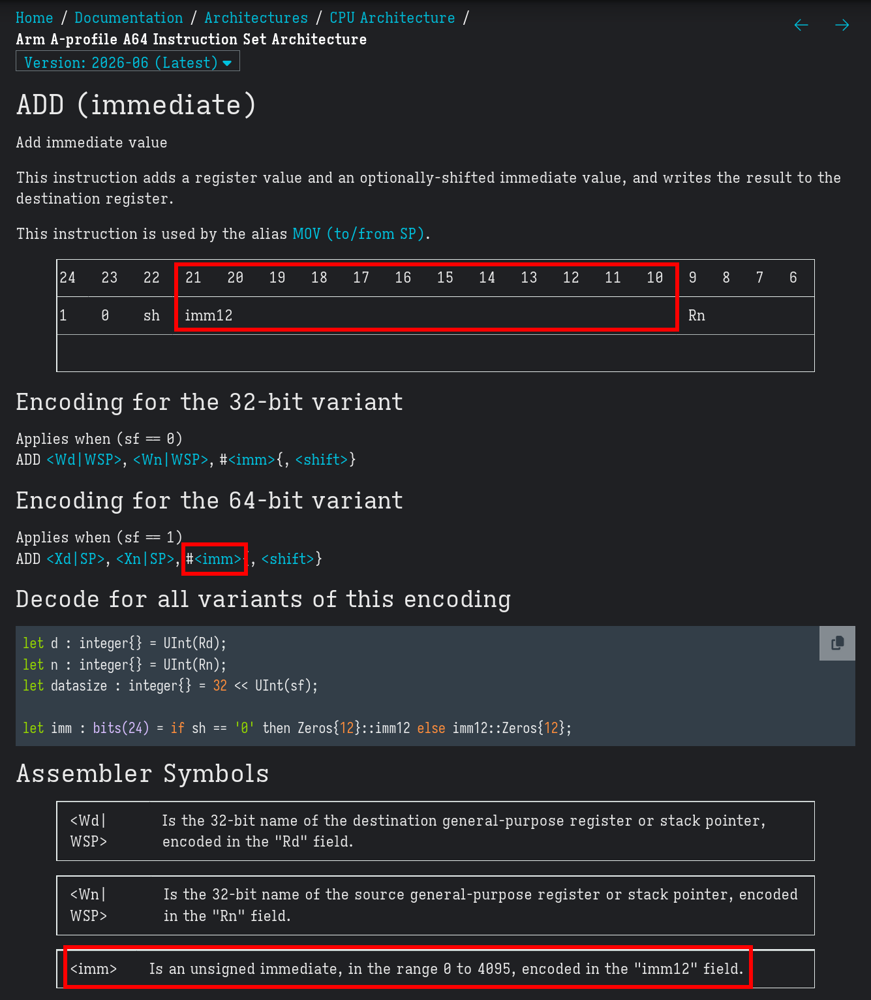
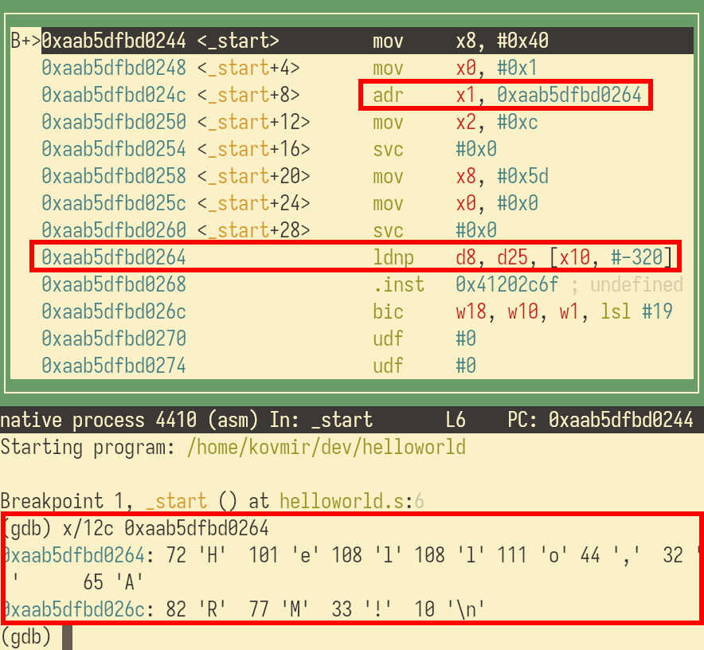
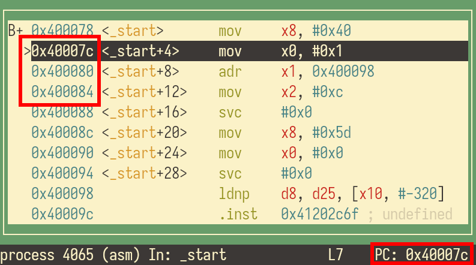
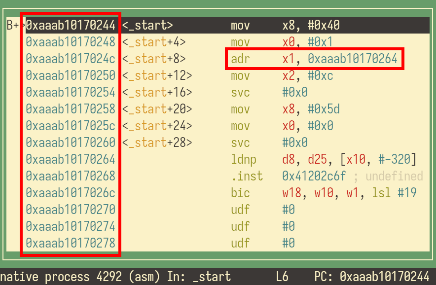
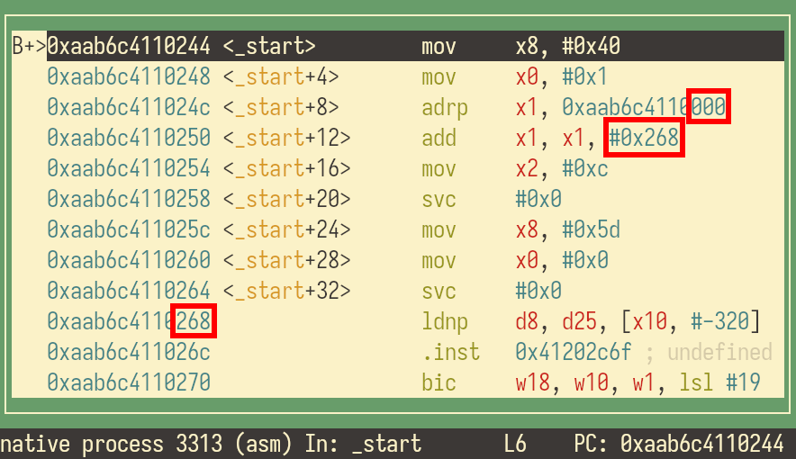
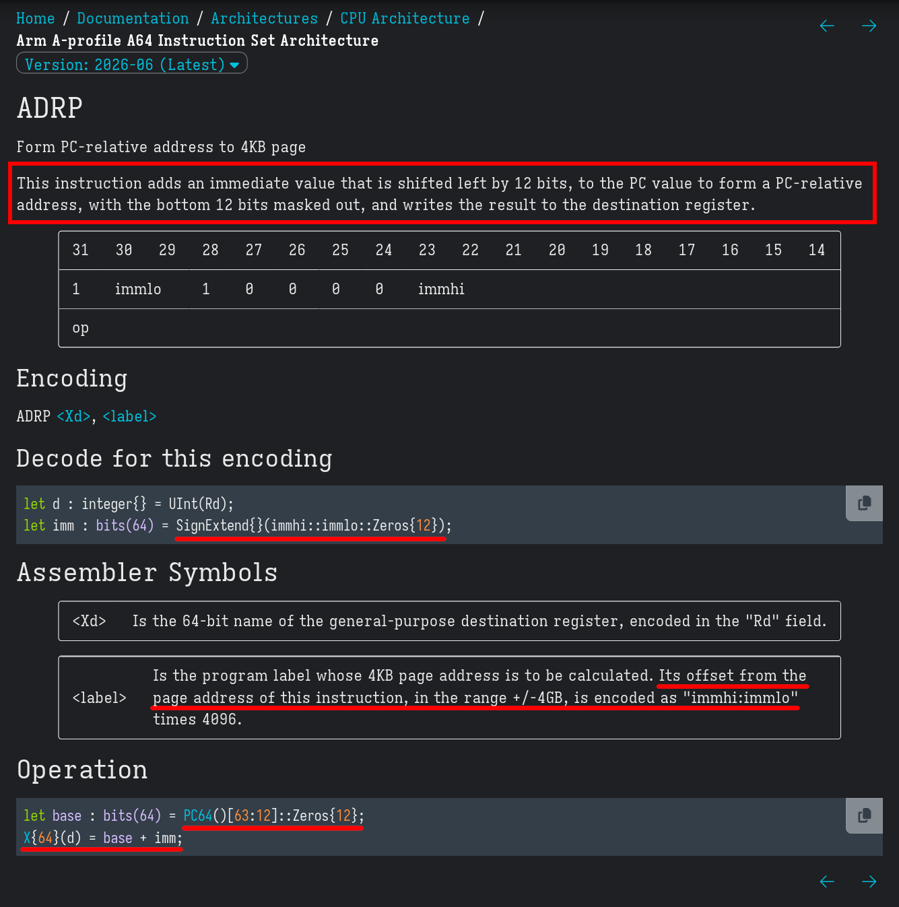

# Introduction

Welcome to this beginner's introduction to ARM assembly. The goal is not to
duplicate or replace the official ARM documentation, but to bridge the gap so
you can navigate it confidently on your own. Topics already well-covered by
ARM—like SIMD programming—are skipped, as is anything likely to change or
become obsolete.

Most of the concepts taught are not ARM-specific but apply to other
architectures. ARM is chosen as an example ISA because it is ubiquitous,
arguably the most relevant architecture, and likely to remain relevant for the
foreseeable future.

# Usage

This article is hands-on from start to finish. Reading alone is not enough—you
should also run, study, tweak, and break the code. I will show examples of how
to do that later on. Pay close attention to error messages, and do not hesitate
to re-read sections when something does not click.

# Prerequisites

Basic C and Linux knowledge is needed, and you must be able to set breakpoints
and step through code in GDB. You know enough C and Linux if you can understand
[this project][battnotify_repo] and feel comfortable working with the terminal.

You also need any ARM computer with 64-bit Linux on board to run the code.
Single-board computers like [ROCKPro64][rockpro64], [Raspberry Pi
3/4/5][rpi_products], or [BPI-M5][bpim5] will do.

# Basics

This is how arithmetic works in ARM:

```asm
// We add 10 to 7 and save the result.
mov x1, #7       // Save 7 into register x1.
add x2, x1, #10  // Add 10 to the contents of x1 and save the result in x2.
                 // x2 is now 17.
```

`x0`, `x1`, `x2` ... `x30` are places where we store data, very much like
variables in C; they are called general purpose registers. `mov` places `7`
into `x1` register, the hash sign indicates 7 is a number. `add` performs the
addition, it adds 10 to the contents of `x1` and saves the result in `x2`.

We say `mov`, `add` ... are [opcodes][a64_opcodes] followed by operands,
e.g., `add` opcode is followed by three operands: `x2`, `x1`, and `#10`. An
opcode, together with its operands, forms an instruction. In practice, the
terms "opcode" and "instruction" are interchangeable.

Install GCC, save the code as `hello.s`, and compile it with `gcc -nostdlib
hello.s -o hello`. `-nostdlib` says we do not need the standard C library.

Try to run the executable `./hello` and observe the output:

```
[1]    2384 illegal hardware instruction  ./hello
```

When you run the program, it is loaded into memory (RAM) and the execution
begins sequentially from top to bottom. `mov` is executed first, then `add`,
and then whatever random byte sequence happens to reside next in memory. This
random byte sequence causes `illegal hardware instruction` error.

To fix the crash, we have to terminate the execution at the end of the program.
There is no exit opcode, we have to ask the operating system to do it for us.
The "exit" concept is nonexistent in assembly, because a CPU can only execute a
particular list of instructions, a CPU cannot "exit" from anything. "Exit" has
meaning to the OS: "take this process off the CPU's schedule." The same applies
to things like file I/O, symlinks, chroot, dynamic memory allocation, etc.
Whenever you ask something from the operating system, that means you are
issuing a syscall (short for "system call"). Syscall #93 in Linux terminates
the execution:

```asm
mov x1, #7
add x2, x1, #10

// The operating system expects to see the ID of the operation in x8.
// 93 means exit, we will see later where this number comes from.
mov x8, #93
// The exit operation expects x0 to hold the exit code.
// Let us use the result of the previous calculation.
mov x0, x2
// Transfer the execution to the operating system.
svc #666 // #666 has no effect, because Linux ignores this value.
         // Even thought Linux ignores it, it has to be there as it is part of the instruction.
         // Other operating systems may somehow react to it.
```

Linux syscalls and their arguments are listed in [syscalls(2)][man_syscalls2],
but you may find [arm64.syscall.sh][a64_syscalls] more convenient. Follow the
link and try to find the above exit syscall; verify the arguments.

Compile and run the program again, it no longer crashes. Run `echo $?` to see
the exit code is indeed 17.

GCC complains it cannot find `_start` during compilation:

```
/usr/bin/ld: warning: cannot find entry symbol _start; defaulting to 0000000000000244
```

We have not specified where the code execution begins, so GCC has to guess. To
prevent the guessing, add `_start:` where needed:

```asm
_start:
	mov x1, #7
	add x2, x1, #10

	mov x8, #93
	mov x0, x2
	svc #0
```

If you recompile and run, the error does not go away. This is because `_start`
has to be `.global` to be visible from outside of the program (to the OS):

```asm
_start:
	mov x1, #7
	add x2, x1, #10

	mov x8, #93
	mov x0, x2
	svc #0

.global _start
```

Compile and run again, the warning goes away.

To truly understand what this is all about, try to break things; e.g. try to
move `.global _start` or `_start:` and see what happens. [ADD
(immediate)][a64_addimm] documentation reveals 12 bits (10-21) of the
instruction are used to encode the immediate (number literal). This gives a
maximum value of 2^12 - 1 = 4095, i.e. `add x0, x1, #5093` will not work:



## Memory & Sections

31 64-bit CPU registers are not enough to hold all the data, which
is why we have memory. ARM instructions do not process data in memory directly;
you must load the data into the registers first. Here is a modest
load-from-memory example:

```asm
.global _start
_start: // Global, marks where execution begins.
	mov x8, #93
	ldr x0, exit_code // Load 8 bytes from where exit_code points to.
	add x0, x0, #5    // We can now process it somehow, like add 5 to it.
	svc #0

// Label the place with allocated memory.
exit_code: // Not global, used internally.
	// .quad reserves 8 bytes in memory,
	// other options will be explored later.
	.quad 15 // Store decimal 15.
```

Assembly code can be subdivided into sections that reside in different memory
regions and have different constraints applied to them; the data section cannot
be executed, and the code section cannot be modified. Sectioned code example:

```asm
// Executable code resides in .text
.section .text
.global _start
_start:
	mov x8, #93
	ldr x0, exit_code
	svc #0

// Read-only data resides in .rodata
.section .rodata
exit_code:
	.quad 15

// Other sections will be explored further down.
```

Try to write into `.rodata` memory address to see the program crash:

```asm
// Executable code resides in .text
.section .text
.global _start
_start:
	mov x0, #6
	// Load the memory address mydata points to.
	adr x1, mydata

	// Store x0 in memory where x1 points to.
	//
	// [] are a dereference operator,
	// meaning take memory address stored in x1,
	// and store x0 there.
	str x0, [x1]
	// ^ this str will result in segmentation fault.


// Read-only data resides in .rodata
.section .rodata
mydata:
	.quad 15
```

If you run the above code, it will crash due to `segmentation fault`, meaning
the program accesses memory it is not allowed to access. Writing to `.rodata`
is illegal.

Turn `.rodata` into `.data`, you can then modify the values held within
the section:

```asm
.section .text
.global _start
_start:
	mov x0, #6
	adr x1, mydata

	str x0, [x1] // No segfault

	mov x8, #93
	mov x0, #0
	svc #0 // Exit

.section .data // Not .rodata
mydata:
	.quad 15
```

`.data` section is for initialized memory, whereas `.bss` section is for
uninitialized memory. `.bss` is a way to preallocate memory. These correspond
to initialized and uninitialized global/static C variables.

`.bss` section usage example:

```asm
	// ...
	adr x1, buffer // Take buffer address.
	mov x2, #0x41
	str x2, [x1]   // Store x2 at [x1].

	// ...

.section .bss
buffer:
	.zero 8  // .allocate 8 byte in .bss (zero-initialized)
```

Unlike `.data.`, `.bss` section cannot be given initial value except 0.

`.data`, `.rodata`, and `.bss` are known as static memory—allocated at the
start of execution, and the *amount of it* stays constant throughout.

# Hello World

Now that you understand sections, you are ready to greet the World:

```asm
// Hello World
.section .text
.global _start
_start:
	// print mesage
	mov x8, 0x40 // write syscall id
	mov x0, #1 // stdout file descriptor
	adr x1, message // load message address
	mov x2, #12 // string length
	svc #0

	// exit with status code
	mov x8, 0x5d // exit syscall
	mov x0, #0 // status code
	svc #0

.section .rodata
message:
	.ascii "Hello, ARM!\n"
```

Compile the above code with `gcc -g -nostdlib /path/to/code.s -o helloworld`
and start a GDB session with `gdb ./helloworld`. In the GDB session type:

```
layout asm
break _start
run
```

`adr` opcode loads the address where `"Hello, ARM!\n"` resides. If you follow
the memory address next to the opcode, you can only see garbage. This is
because the debugger (disassembler) does not distinguish between code and data
in memory. In other words, the string is there, but the debugger tries to
interpret it as code. In GDB prompt type `x/12c 0xaab5dfbd0264` (adjust
address) to ask GDB to interpret 12 bytes starting from the given memory
address as characters:



# Compiler & Assembler

From [GCC compiler man page][man_gcc1]:

```
When you invoke GCC, it normally does preprocessing, compilation, assembly and
linking.
```

That means when you invoke `gcc /path/to/program.c`, GCC runs 4 programs in
sequence: preprocessor, compiler, assembler, and linker. Preprocessor edits C
code (e.g. resolves `#ifdef`s), compiler rewrites C into assembly, assembler
encodes the assembly instructions in binary format, and the linker combines
object files into an executable. Assembly code does not need preprocessing and
compilation. In other words, there is no need to invoke GCC; you can run the
assembler and linker manually:

```sh
as -g -o helloworld.o helloworld.s
ld -o helloworld helloworld.o
```

You may find this [Makefile][make_guide] useful:

```make
project = helloworld

build:
	as -g -o $(project).o $(project).s
	ld $(LDFLAGS) -o $(project) $(project).o

gdb:
	gdb ./$(project)

clean:
	rm -f $(project) $(project).o

.PHONY: build gdb clean
```

Using GCC is fine, just be aware of the underlying process.

# Position Independent Executable

Read [adr instruction][a64_adr] description:

```
This instruction adds an immediate value to the PC value to form a PC-relative
address, and writes the result to the destination register.
```

PC is Program Counter, it is a register that holds the address of the next
instruction to be executed. Start a GDB session and see how PC register value
changes every time you step through the code:



An immediate value is a number literal (constant).
During execution this instruction reads the current PC value and adds the
immediate to it. This immediate is the *distance* in bytes to the given address
from the current instruction (PC value).

If the assembler encodes the absolute memory address, the code must be loaded
at that address every time it is executed; if you move the code, the fixed
absolute address no longer points to the data.

`adr` reads PC value and adds the distance to `message` in bytes. the assembler
does not bake in the absolute `message` address, it bakes the *distance* from
`adr` to `message` into the binary:

```asm
// ...
	// Add the offset, the distance to message label, to the current PC value
	// to compute the absolute message label address at run time.
	adr x1, message
	// ...

.section .rodata
message:
	.ascii "Hello, ARM!\n"
```

To see this in action, compile Hello ARM code using the above `Makefile` and
run GDB:

```sh
make LDFLAGS=-pie
make gdb
```

In a GDB session:

```
set disable-randomization off
layout asm
break _start
run
run
run
...
```



Every time you invoke `run`, notice how the memory layout changes but the code
is still able to reach the data. This is precisely because the encoded `adr`
instruction stores the distance—not the location—from `adr` to the data. It
looks like the address by `adr` changes, but actually doesn't; that's GDB
resolving the absolute address for us. *This works because even though the
memory addresses change, the relative distances across code and data is
constant, i.e. the string is always the same distance away from `adr`.*

Consider [`adr` encoding][a64_adr], 21 bytes `immhi:immlo` are used to encode
the offset in bytes, which gives +/-1MiB range away from PC; too little
sometimes. [`adrp` instruction][a64_adrp] allows PC-relative addressing
+/-4GiB. `adrp` subdivides memory into 4KiB aligned regions—called pages—and
encodes the distance in the amount of 4K pages (not bytes, like `adr`):

```asm
// ...
	adrp x1, message // x1 now points to the page with the data.
	add x1, x1, :lo12:message // x1 now points to the data.

.section .rodata
message:
	.ascii "Hello, ARM!\n"
```

Here is a diagram to help you understand:

```
MEMORY:

0xaab42a5f0000       0xaab42a5f1000       0xaab42a5f2000       0xaab42a5f3000
|                    |                    |                    |          ^^^
|        4096        |         4K         |         4K         |          |
|<------------------>|<------------------>|<------------------>|        Aligned
|                    |                    |  0x264             |
|         adrp       |                    |<------->message:   |
          ^                                         ^
          |                 Distance constant       |
          0xaab42a5f024c<-------------------------->0xaab42a5f2264

ALGORITHM:

adrp x1, message
  0xaab42a5f024c                                (PC)
  0xaab42a5f0000                                (Current page address)
             ^^^
  0xaab42a5f2000 = 0xaab42a5f0000 + 2*4096 = x1 (Message page address)
            ^                       ^ offset

add x1, x1, :lo12:message
  0xaab42a5f2264 = 0xaab42a5f2000 + 0x264 = x1 (Message address)
```

Recompile `adrp` version of Hello World, and start a similar GDB session to
verify position independence of this code:



All `adrp` details come from the [official ARM documentation][a64_adrp]:



Notice that ARM gives instruction descriptions both in words and in pseudocode.
The offset is split into two parts, `immhi` and `immlo`, which are then
combined and shifted left by 12: `immhi::immlo::Zeros{12}`. Each left shift of
a binary number is equivalent to multiplication by 2. `SignExtend` adds missing
zeros on the left to make it a 64-bit value (preserving the sign).
`PC64()[63:12]` means we take bits [63:12] from PC and discard the rest, then
shift left by 12: `::Zeros{12}`. `X{64}(d) = base + imm` means we add the
offset to PC and save the result in the 64-bit destination register. ARM
pseudocode is documented as well, but most of it should be clear to a C
programmer.

# Stack

I assume you are familiar with the stack data structure. Apart from registers
and static memory, the stack is available to hold temporary data. `sp` register
holds the address of the top of the stack:

```asm
// Push onto stack (save data).
mov x0, #42
sub sp, sp, #16 // Subtract 16 bytes first; allocate memory.
str x0, [sp]    // Store x0; sp holds a memory address, use [] to dereference.

mov x0, #63 // Overwrite x0.
// ...

// Pop from stack.
ldr x0, [sp]   // Retrieve data.
// x0 is now 42 again.
add sp, sp, #16 // Add 16 bytes after; deallocate memory.
```

In ARM, the stack grows top to bottom, from high to low memory addresses; that
is why you subtract to add data. Stack (de)allocations in ARM must be in
multiples of 16. Here is the equivalent code, but simpler (read about [ARM
addressing modes][a64_ldrstr] for details):

```asm
mov x0, #42
// Though x0 is 8 bytes in size, by design we must allocate multiples of 16.
str x0, [sp, #-16]! // Push

// ...

ldr x1, [sp], #16 // Pop
```

Run the following code, then try to misalign the stack, see what happens:

```asm
.section .text
.global _start

_start:
	mov x1, #42
	str x1, [sp, #-16]! // push

	mov x1, #0xf7

	ldr x1, [sp], #16 // pop

	mov x8, #93
	mov x0, x1
	svc #0 // exit
```

Read [Using the Stack in AArch64: Implementing Push and Pop][a64_stackusage]
for more detailed examples.

# Branching

There are no C-like function calls in assembly; there are branch instructions
to jump to different locations:

```asm
.section .text
.global _start
_start:
	mov x1, #1
	b my_func // go to my_func
ret_addr:
	mov x8, 0x5d
	mov x0, x1
	svc #0 // exit with 15 code

my_func:
	mov x1, #15 // overwrite x1
	b ret_addr // go to ret_addr
```

If `sub` instruction simply performs subtraction, `subs` subtracts and reports
additional information about the outcome, such as whether the result is
negative or zero. The same holds for `adds` and a few others. `subs` and the
like report the result by setting the appropriate bit in `NZCV` register:

```asm
.section .text
.global _start
_start:
	mov x0, #4
	mov x1, #66

	subs x0, x0, #2
	b.eq my_func // x0 != 0, no jump.
	subs x0, x0, #2
	b.eq my_func // x0 == 0, jump.

exit:
	mov x8, 0x5d
	mov x0, x1 // Guess the value of x1.
	svc #0

my_func:
	add x1, x1, #1
	b exit
```

`cmp` compares registers and reports to `NZCV` register in a similar fashion:

```asm
cmp x0, x1
b.ne 1 // Branch if not 0, e.g. x0 != x1.
```

`NZCV` is not a general purpose register, so `mov` can't access it; use `mrs`
and `msr` instead:

```asm
mrs x0, nzcv // Read from NZCV.
msr nzcv, x0 // Write to NZCV.
```

`info registers` in a GDB session displays CPU register values. Be aware that
`NZCV` is part of `CPSR` register in GDB. This is due to the changes in the
recent ARM ISA specifications.

The following branching method resembles function calls in C-like languages.
Save the return address to `x30` and branch, then get the address from `x30` to
branch back:

```asm
.section .text
.global _start
_start:
	mov x0, #4

	// Set x30 to PC+4, then branch to my_func.
	// x30 now holds the return address.
	bl my_func

	// `ret` branches here.
	mov x8, 0x5d
	svc #0 // exit


my_func:
	add x0, x0, #1
	ret // x30 must not be overwritten for this to work.
```

`bl` uses `x30` to save the return address; for this reason, `x30` is also
referred to as the link register. There are many more branch instructions and
the ones that update the status register; try to find and use them.

# Calling Convention

For your code to interface with other people's code in C or assembly, everyone
must follow the calling convention. You have to use `x8` for syscall numbers;
that is part of the convention. You follow the convention placing a syscall
number where the operating system expects to find it. `x0` .. `x7` are used to
pass arguments and return values to/from other functions, just like with
syscalls. `x19` .. `x28` can be freely used, `x9` .. `x15` must be preserved.
"Must be preserved" means you are free to use them, but make sure you restore
the original values before the function return. Refer to [ARM Architecture
Procedure Call Standard (AAPCS64)][a64_pcs] for the remaining details.

Here is a little demo to illustrate the concept:

```asm
// Compile with `gcc /path/to/file.s`.
.section .rodata
msg:
	// .asciz is a NULL-terminated string.
	.asciz "Hello from assembly! The answer is %d.\n"

.section .text
.global main
// The C standard library provides its own `_start` to prepare the environment,
// which then calls `main`.
main:
	// Here it does not matter what these are; what matters is that we have
	// to follow the calling convention saving these.
	stp x29, x30, [sp, #-16]! // Save them on stack.
	// x29 must point to the current stack frame by convention.
	// Stack frame is the stack segment used by the current function,
	// x29 is used by debuggers to provide a backtrace, `bt` in GDB.
	mov x29, sp

	// Populate registers with data so we can see whether it persists.
	// The sum of these register values will be the exit code. If the exit
	// code is 7 + 3 + 5 = 15, then the values persist.
	mov x10, #7
	mov x11, #3
	mov x21, #5

	// Prepare printf arguments...
	// x0 = string address (1st printf arg).
	adrp x0, msg
	add  x0, x0, :lo12:msg
	// x1 = integer for %d (2nd printf arg).
	mov x1, #42

	// printf function may corrupt registers x9 .. x15, always assume it
	// will. Suppose we care about x10 and x11, we can save their values on
	// stack and restore them after the function call.
	stp x10, x11, [sp, #-16]!
	bl  printf
	// x10 and x11 are corrupt at this point, restore their values from stack.
	ldp x10, x11, [sp], #16

	// x9 .. x15 must remain untouched after the function returns.

	// Prepare the exit code.
	// x0 holds the function return value by convention;
	// main() return value in this case.
	add x0, x10, x11
	add x0, x0, x21

	// The following code line restores the previously saved register
	// values.
	ldp x29, x30, [sp], #16

	ret
```

Consider C Hello World `main()` disassembly:

```c
// Compile with     `gcc /path/to/file.c`
// Disassemble with `objdump -d ./a.out`
#include <stdio.h>

int
main(void)
{
	printf("Hello, World!\n");
}
```

The compiler preserves `x29` and `x30`, `x0` holds the first `printf()`
argument:

```
00000000000007a8 <main>:
 7a8:	a9bf7bfd 	stp	x29, x30, [sp, #-16]!
 7ac:	910003fd 	mov	x29, sp
 7b0:	90000000 	adrp	x0, 0 <_init-0x5d0>
 7b4:	911fa000 	add	x0, x0, #0x7e8
 7b8:	97ffffa6 	bl	650 <puts@plt>
 7bc:	52800000 	mov	w0, #0x0                   	// #0
 7c0:	a8c17bfd 	ldp	x29, x30, [sp], #16
 7c4:	d65f03c0 	ret
```

Let us see how to interface C and assembly code:

```c
// candasm.c
#include <stdio.h>

int my_func(int a, int b);

int main()
{
	int a = 4;
	int b = 5;
	int result = my_func(a, b);
	printf("Calling assembly function my_function "
		"with x0=%d and x1=%d results in %d\n", a, b, result);
	return 0;
}
```

```asm
// func.s
.section .text
// my_func has to be visible outside of this file.
.global my_func
my_func:
	// Arguments are in x0 and x1.
	add x0, x0, x1
	ret // x0 contains the return value.
```

Compile the above project with `gcc /path/to/c/file.c /path/to/asm/file.s`, or
leverage the following `Makefile`:

```make
# Makefile
CC      = gcc
AS      = as
CFLAGS  = -c -g -Wall
ASFLAGS = -g

# Executable name
TARGET  = candasm

# Save the code as candasm.c and func.s
OBJ     = candasm.o func.o

all: $(TARGET)

$(TARGET): $(OBJ)
	$(CC) -o $(TARGET) $(OBJ)

%.o: %.c
	$(CC) $(CFLAGS) $< -o $@

%.o: %.s
	$(AS) $(ASFLAGS) $< -o $@

clean:
	rm -f $(OBJ) $(TARGET)

.PHONY: all clean
```

This is what a factorial function implementation would look like:

```asm
my_fact:
	mov x0, #1 // x0 = result, start from 1
	cbz x1, 2f // 0! == 1, return 1
1:
	mul x0, x0, x1 // multiply
	subs x1, x1, 1 // subtract 1
	b.ne 1b // keep multiplying until 0
2:
	ret
```

[`cbz`][a64_cbz] is a conditional jump. `2f` refers to the label
`2:` below, whereas `1b` refers to the label `1:` above.

# Exercise

Implement [strnlen(3)][strnlen3] from the standard C library in ARM assembly
and call it from C code.

# FAQ

**Q: What is ARM?**

A: ARM is a public company.

A: ARM is an Instruction Set Architecture (ISA), basically a [set of
instructions][a64_opcodes]. x86 and RISC-V are alternative ISAs. "ARM CPU"
means it has been designed to execute ARM instructions. This is one of the
reasons you cannot compile a program for an x86 CPU, and execute it on an ARM
CPU: the instruction sets are different.

**Q: What is assembly/assembler?**

A: Assembly is a set of direct CPU instructions such as [ARM][a64_opcodes] or
x86 (also known as "assembly language").

A: An assembler is a computer program that takes handwritten assembly files as
input and encodes them in binary format.

**Q: What are 32-bit and 64-bit ARM CPUs?**

A: Colloquial terms for ARM CPUs capable of executing A32 and A64 ISAs
respectively.

**Q: What are A32, A64, T32, Thumb, Thumb-2, AArch32, AArch64, ARMv6-M, ARMv8-A?**

A: A32, A64, and T32 are ARM ISAs. The numbers in A32 and A64 correspond to
general purpose register (`x0` ... `x30` in A64) sizes. Bigger registers in A64
imply greater throughput (performance) and more addressable memory (bigger
registers fit more addresses). ISAs also define how instructions are encoded.
Both A32 and A64 instructions are 32-bit wide, whereas T32 allows mixed 16-bit
and 32-bit instruction sizes. Thumb is a previous version of T32, and Thumb-2
is an alias for T32. T32 is desired in microcontrollers where flash storage
(non-volatile memory) is limited. Terms like ARMv8-A are architecuters; they
define (not only) a subset of an ISA. The letters A, R, and M at the end define
the [architecture profile.][arm_isaprofiles] [A single ARM CPU may be able to
execute instructions encoded in both A64 and A32. A CPU executing A64
instructions operates in AArch64 execution state, while a CPU executing A32 or
T32 instructions operates in AArch32.][arm_execstates] This whole time I have
been talking about A64.

**Q: What is ARM Cortex?**

A: Apart from the ISAs, ARM releases various CPU core specifications, or simply
cores. ARM calls them Cortex cores. A core defines the ISA, its extensions,
cache sizes, etc.; think of it as a CPU core blueprint. [Raspberry Pi 5 comes
with four Cortex-A76 cores][rpi5_databrief]. The A refers to the ISA profile
and the number usually reflects performance relative to the other Cortex cores
(higher is faster).

**Q: Does ARM glossary exist?**

A: [Yes, it does.][arm_glossary]

**Q: How do I ask GCC to generate the assembler code from C?**

A: `gcc -S -fverbose-asm /path/to/c/file.c -o /path/to/asm/file.s`

# Further Steps

* Implement C standard library functions in ARM assembly.
* Write programs in C and study the assembly code emitted by the compiler.
* Learn to navigate the [official ARM documentation][arm_docs].
* Read ARM's [Learn the Architecture Guides][arm_archlearn].
* See ARM's [Learning Paths][arm_learnpaths]
* Buy an [STM32 Nucleo board][stm32_nucleo] and get into ARM microcontroller
  programming.

# License

[CC BY-NC-ND 4.0][cc_byncnd40]


[a64_addimm]: https://developer.arm.com/documentation/ddi0602/2026-03/Base-Instructions/ADD--immediate---Add-immediate-value-?lang=en
[a64_adr]: https://developer.arm.com/documentation/ddi0602/2026-06/Base-Instructions/ADR--Form-PC-relative-address-?lang=en
[a64_adrp]: https://developer.arm.com/documentation/ddi0602/2026-06/Base-Instructions/ADRP--Form-PC-relative-address-to-4KB-page-?lang=en
[a64_cbz]: https://developer.arm.com/documentation/ddi0602/2026-06/Base-Instructions/CBZ--Compare-and-branch-on-zero-?lang=en
[a64_ldrstr]: https://developer.arm.com/documentation/102374/0103/Loads-and-stores---addressing
[a64_opcodes]: https://developer.arm.com/documentation/ddi0602/2026-06/Base-Instructions?lang=en
[a64_pcs]: https://github.com/ARM-software/abi-aa/blob/main/aapcs64/aapcs64.rst#6the-base-procedure-call-standard
[a64_stackusage]: https://developer.arm.com/community/arm-community-blogs/b/architectures-and-processors-blog/posts/using-the-stack-in-aarch64-implementing-push-and-pop
[a64_syscalls]: https://arm64.syscall.sh/
[alpine_dl]: https://alpinelinux.org/downloads/
[arm_archlearn]: https://www.arm.com/architecture/learn-the-architecture
[arm_docs]: https://developer.arm.com/
[arm_execstates]: https://developer.arm.com/documentation/102412/0103/Execution-and-Security-states/Execution-states
[arm_glossary]: https://developer.arm.com/documentation/105565/200
[arm_isaprofiles]: https://www.arm.com/architecture/cpu
[arm_learnpaths]: https://learn.arm.com/
[arm_nomenclature]: https://developer.arm.com/community/arm-community-blogs/b/architectures-and-processors-blog/posts/arm-fundamentals-introduction-to-understanding-arm-processors
[battnotify_repo]: https://git.sr.ht/~kovmir/battnotify
[bpim5]: https://docs.banana-pi.org/en/BPI-M5/BananaPi_BPI-M5
[cc_byncnd40]: https://creativecommons.org/licenses/by-nc-nd/4.0/
[make_guide]: https://makefiletutorial.com/
[man_gcc1]: https://man.archlinux.org/man/gcc.1#DESCRIPTION
[man_syscalls2]: https://man.archlinux.org/man/syscalls.2
[rockpro64]: https://pine64.org/devices/rockpro64/
[rpi5_databrief]: https://pip-assets.raspberrypi.com/categories/892-raspberry-pi-5/documents/RP-008348-DS-6-raspberry-pi-5-product-brief.pdf
[rpi_products]: https://www.raspberrypi.com/products/
[stm32_nucleo]: https://www.st.com/en/evaluation-tools/stm32-nucleo-boards.html
[strnlen3]: https://man.archlinux.org/man/strnlen.3
